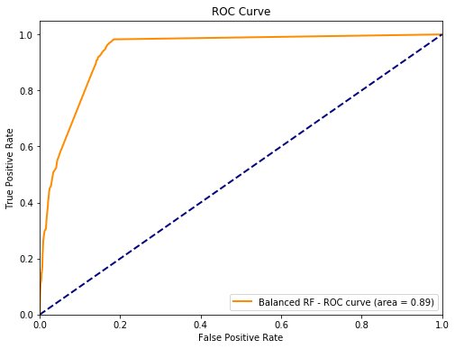

```python
import pandas 
import numpy 
import pickle
import sklearn
from sklearn.model_selection import train_test_split, cross_val_predict
from sklearn.ensemble import RandomForestClassifier
from sklearn import metrics
from sklearn.metrics import roc_auc_score, roc_curve, auc, classification_report, confusion_matrix
from sklearn.model_selection import cross_val_score
from sklearn.decomposition import PCA
import matplotlib.pyplot as plt
import scikitplot as skplt
import warnings
warnings.filterwarnings('ignore')
```


```python
df = pandas.read_csv("feature_test_matrix_051120.csv")
df.GenePair = df.GenePair.str.replace('\t', '_')
df.set_index('GenePair', inplace=True)
df.shape 
print(sum(df.FI == 0))
print(sum(df.FI == 1))

X_val = df[df.columns[~df.columns.isin(['FI'])]]
y_val = df['FI']
```

    2196398
    26076


```python
clf = pickle.load( open( "clf_RF_balanced_89ROC.pkl", "rb" ) )
prd = clf.predict(X_val)
clf.score(X_val, y_val)
auc = roc_auc_score(y_val, prd)
y_predict_probabilities = clf.predict_proba(X_val)[:,1]
fpr, tpr, _ = roc_curve(y_val, y_predict_probabilities)
print(round(auc, 2),
confusion_matrix(y_val, prd),
round(metrics.recall_score(y_val, prd), 2),              # sensitivity tp / (tp + fn)
round(metrics.precision_score(y_val, prd), 2), sep='\n') # specificity tp / (tp + fp)
```

    0.89
    [[1879429  316969]
     [   2155   23921]]
    0.92
    0.07


```python
clf2 = pickle.load( open( "clf_LinearSVC_balanced_90ROC.pkl", "rb" ) )
prd2 = clf2.predict(X_val)
clf2.score(X_val, y_val)
auc2 = roc_auc_score(y_val, prd2)
# y_predict_probabilities2 = clf2.predict_proba(X_val)[:,1]
# AttributeError: 'LinearSVC' object has no attribute 'predict_proba'
fpr2, tpr2, _ = roc_curve(y_val, prd2)
print(round(auc2, 2),
confusion_matrix(y_val, prd2),
round(metrics.recall_score(y_val, prd2), 2),              
round(metrics.precision_score(y_val, prd2), 2), sep='\n') 
```

    0.89
    [[1871000  325398]
     [   1992   24084]]
    0.92
    0.07


```python
plt.figure(figsize=[8, 6])
plt.plot(fpr, tpr, color='darkorange',
         lw=2, label='Balanced RF - ROC curve (area = %0.2f)' % round(auc, 2))
plt.plot([0, 1], [0, 1], color='navy', lw=2, linestyle='--')
plt.xlim([0.0, 1.0])
plt.ylim([0.0, 1.05])
plt.xlabel('False Positive Rate')
plt.ylabel('True Positive Rate')
plt.title('ROC Curve')
plt.legend(loc="lower right")
plt.show()
```





```python
feature_importance = clf.feature_importances_
feature_importance = 100 * (feature_importance / feature_importance.max())

df_importance = pandas.DataFrame({'features':df[df.columns[~df.columns.isin(['FI'])]].columns.values, 'RF_importance':feature_importance})
df_importance = df_importance.sort_values("RF_importance", axis=0, ascending=False)
df_importance
```


<div>
<style scoped>
    .dataframe tbody tr th:only-of-type {
        vertical-align: middle;
    }

    .dataframe tbody tr th {
        vertical-align: top;
    }

    .dataframe thead th {
        text-align: right;
    }
</style>
<table border="1" class="dataframe">
  <thead>
    <tr style="text-align: right;">
      <th></th>
      <th>features</th>
      <th>RF_importance</th>
    </tr>
  </thead>
  <tbody>
    <tr>
      <th>6</th>
      <td>GOBPSharing</td>
      <td>100.000000</td>
    </tr>
    <tr>
      <th>0</th>
      <td>HumanPPI</td>
      <td>71.075066</td>
    </tr>
    <tr>
      <th>4</th>
      <td>YeatPPI</td>
      <td>44.059599</td>
    </tr>
    <tr>
      <th>13</th>
      <td>gobp</td>
      <td>35.592963</td>
    </tr>
    <tr>
      <th>18</th>
      <td>jensencompartmenttextmining</td>
      <td>30.859165</td>
    </tr>
    <tr>
      <th>5</th>
      <td>DomainInteractions</td>
      <td>24.747817</td>
    </tr>
    <tr>
      <th>24</th>
      <td>nursa</td>
      <td>18.549145</td>
    </tr>
    <tr>
      <th>2</th>
      <td>FlyPPI</td>
      <td>11.855167</td>
    </tr>
    <tr>
      <th>1</th>
      <td>MousePPI</td>
      <td>9.909957</td>
    </tr>
    <tr>
      <th>14</th>
      <td>gomf</td>
      <td>7.329092</td>
    </tr>
    <tr>
      <th>12</th>
      <td>genesigdb</td>
      <td>7.150296</td>
    </tr>
    <tr>
      <th>50</th>
      <td>GTEx-Esophagus-Mucosa</td>
      <td>6.258286</td>
    </tr>
    <tr>
      <th>16</th>
      <td>hubs</td>
      <td>4.963917</td>
    </tr>
    <tr>
      <th>45</th>
      <td>GTEx-Cells-Culturedfibroblasts</td>
      <td>4.493326</td>
    </tr>
    <tr>
      <th>84</th>
      <td>TCGA-HNSC</td>
      <td>2.485109</td>
    </tr>
    <tr>
      <th>71</th>
      <td>GTEx-Thyroid</td>
      <td>2.434222</td>
    </tr>
    <tr>
      <th>92</th>
      <td>TCGA-MESO</td>
      <td>2.419405</td>
    </tr>
    <tr>
      <th>46</th>
      <td>GTEx-Cells-EBV-transformedlymphocytes</td>
      <td>2.350456</td>
    </tr>
    <tr>
      <th>20</th>
      <td>jensendiseasetextmining</td>
      <td>2.093410</td>
    </tr>
    <tr>
      <th>90</th>
      <td>TCGA-LUAD</td>
      <td>1.991439</td>
    </tr>
    <tr>
      <th>17</th>
      <td>hugenavigator</td>
      <td>1.976117</td>
    </tr>
    <tr>
      <th>58</th>
      <td>GTEx-Muscle-Skeletal</td>
      <td>1.752045</td>
    </tr>
    <tr>
      <th>102</th>
      <td>TCGA-THCA</td>
      <td>1.688225</td>
    </tr>
    <tr>
      <th>104</th>
      <td>TCGA-UCEC</td>
      <td>1.537537</td>
    </tr>
    <tr>
      <th>98</th>
      <td>TCGA-SARC</td>
      <td>1.436003</td>
    </tr>
    <tr>
      <th>93</th>
      <td>TCGA-OV</td>
      <td>1.403525</td>
    </tr>
    <tr>
      <th>60</th>
      <td>GTEx-Ovary</td>
      <td>1.282211</td>
    </tr>
    <tr>
      <th>68</th>
      <td>GTEx-Spleen</td>
      <td>1.270575</td>
    </tr>
    <tr>
      <th>89</th>
      <td>TCGA-LIHC</td>
      <td>1.152927</td>
    </tr>
    <tr>
      <th>26</th>
      <td>proteomicsdb</td>
      <td>0.961217</td>
    </tr>
    <tr>
      <th>...</th>
      <td>...</td>
      <td>...</td>
    </tr>
    <tr>
      <th>94</th>
      <td>TCGA-PAAD</td>
      <td>0.005960</td>
    </tr>
    <tr>
      <th>105</th>
      <td>TCGA-UCS</td>
      <td>0.005467</td>
    </tr>
    <tr>
      <th>99</th>
      <td>TCGA-SKCM</td>
      <td>0.005382</td>
    </tr>
    <tr>
      <th>97</th>
      <td>TCGA-READ</td>
      <td>0.005361</td>
    </tr>
    <tr>
      <th>48</th>
      <td>GTEx-Colon-Transverse</td>
      <td>0.005100</td>
    </tr>
    <tr>
      <th>67</th>
      <td>GTEx-SmallIntestine-TerminalIleum</td>
      <td>0.004949</td>
    </tr>
    <tr>
      <th>62</th>
      <td>GTEx-Pituitary</td>
      <td>0.004944</td>
    </tr>
    <tr>
      <th>47</th>
      <td>GTEx-Colon-Sigmoid</td>
      <td>0.004818</td>
    </tr>
    <tr>
      <th>36</th>
      <td>GTEx-Brain-Cerebellum</td>
      <td>0.004655</td>
    </tr>
    <tr>
      <th>49</th>
      <td>GTEx-Esophagus-GastroesophagealJunction</td>
      <td>0.004599</td>
    </tr>
    <tr>
      <th>95</th>
      <td>TCGA-PCPG</td>
      <td>0.004479</td>
    </tr>
    <tr>
      <th>53</th>
      <td>GTEx-Heart-LeftVentricle</td>
      <td>0.004381</td>
    </tr>
    <tr>
      <th>28</th>
      <td>GTEx-Adipose-Visceral-Omentum</td>
      <td>0.004321</td>
    </tr>
    <tr>
      <th>73</th>
      <td>GTEx-Vagina</td>
      <td>0.004213</td>
    </tr>
    <tr>
      <th>51</th>
      <td>GTEx-Esophagus-Muscularis</td>
      <td>0.004069</td>
    </tr>
    <tr>
      <th>66</th>
      <td>GTEx-Skin-SunExposed-Lowerleg</td>
      <td>0.003808</td>
    </tr>
    <tr>
      <th>44</th>
      <td>GTEx-Breast-MammaryTissue</td>
      <td>0.003768</td>
    </tr>
    <tr>
      <th>65</th>
      <td>GTEx-Skin-NotSunExposed-Suprapubic</td>
      <td>0.003628</td>
    </tr>
    <tr>
      <th>40</th>
      <td>GTEx-Brain-Hypothalamus</td>
      <td>0.003621</td>
    </tr>
    <tr>
      <th>43</th>
      <td>GTEx-Brain-Substantianigra</td>
      <td>0.003617</td>
    </tr>
    <tr>
      <th>39</th>
      <td>GTEx-Brain-Hippocampus</td>
      <td>0.003613</td>
    </tr>
    <tr>
      <th>42</th>
      <td>GTEx-Brain-Spinalcord-cervicalc-1</td>
      <td>0.003604</td>
    </tr>
    <tr>
      <th>64</th>
      <td>GTEx-Skin-All</td>
      <td>0.003252</td>
    </tr>
    <tr>
      <th>38</th>
      <td>GTEx-Brain-FrontalCortex-BA9</td>
      <td>0.003198</td>
    </tr>
    <tr>
      <th>37</th>
      <td>GTEx-Brain-Cortex</td>
      <td>0.003191</td>
    </tr>
    <tr>
      <th>74</th>
      <td>GTEx-WholeBlood</td>
      <td>0.003105</td>
    </tr>
    <tr>
      <th>21</th>
      <td>jensentissuetextmining</td>
      <td>0.002720</td>
    </tr>
    <tr>
      <th>34</th>
      <td>GTEx-Brain-Caudate-basalganglia</td>
      <td>0.002577</td>
    </tr>
    <tr>
      <th>70</th>
      <td>GTEx-Testis</td>
      <td>0.002222</td>
    </tr>
    <tr>
      <th>19</th>
      <td>jensendiseasecurated</td>
      <td>0.001708</td>
    </tr>
  </tbody>
</table>
<p>106 rows × 2 columns</p>
</div>


